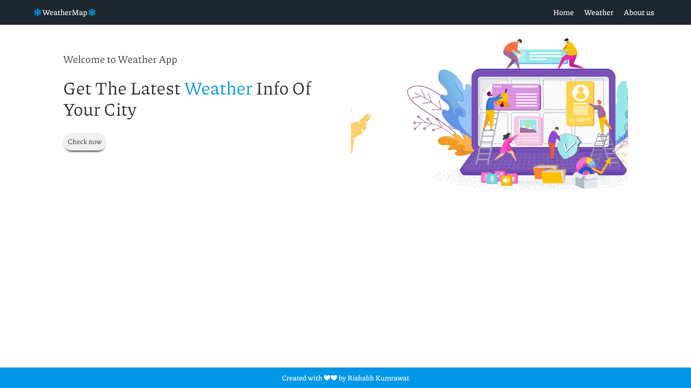
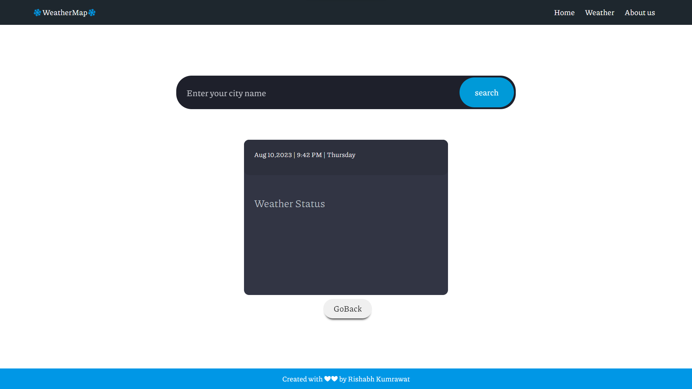
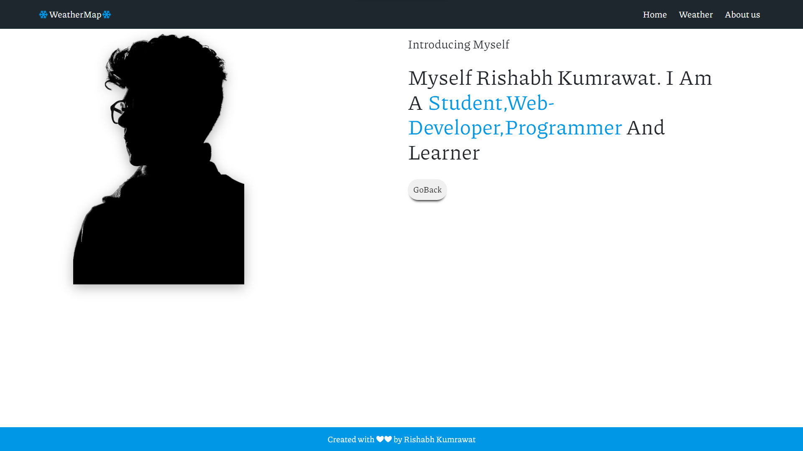

# ⚡Weather Project

Explore the world's weather like never before with our Weather Project. Powered by the OpenWeather API, this innovative application provides real-time weather data and forecasts to keep you informed and prepared for any climate.

## 🛠Tech Stack

**Client:** HTML, CSS , JavaScript

**Server:** NodeJs, ExpressJs

## 🔄API Reference

```
  https://api.openweathermap.org/data/2.5/weather?q=${cityVal}&units=metric&appid=YOUR_APP_ID
```

# ✅Features:
🌤️ **Current Conditions**: Get instant updates on the current weather conditions in your location or any city around the globe. Stay ahead with accurate temperature, humidity, wind speed, and more.

☔ **Detailed Forecasts**: Plan ahead with detailed weather forecasts for the upcoming days. Receive insights into temperature trends, precipitation chances, and atmospheric changes.

🌍 **Global Coverage**: Whether you're an adventurer or a traveler, access weather information for countless cities worldwide. Explore local weather nuances and make informed decisions.

🕶️ **User-Friendly Interface**: Enjoy a visually appealing and intuitive user interface. Effortlessly navigate through weather data and forecasts, making it easy to access the information you need.

📊 **Graphical Insights**: Visualize weather patterns with interactive graphs and charts. Track temperature variations, rainfall trends, and other key metrics over time.

📡 **Real-Time Updates**: Stay up-to-date with real-time weather updates. Our app ensures you're informed about sudden weather changes and alerts for a seamless experience.

🔗 **Powered by OpenWeather API**: Our project leverages the robust capabilities of the OpenWeather API, guaranteeing accurate and reliable weather information.


## 🚀 Project Installation Guide 

Before you begin, ensure that you have **Node.js** installed on your local machine.

 **Clone the Project:**
   Start by cloning this repository to your local machine using your preferred method.

 **Open in Code Editor:**
   Navigate to the project folder and open it in your preferred code editor. We recommend **Visual Studio Code** for a smooth experience.


Open terminal and move to the project directory and run the below command

```bash
  npm install
  npm start
```

- Project will be live on localhost:8000


<p align="center">
  
</p>
<p align="center">
  
</p>
<p align="center">
  
</p>
